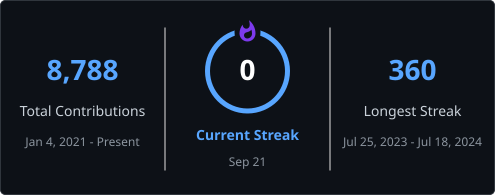
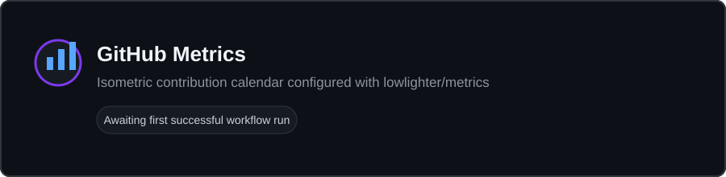

# MD RABIUL AWAL SHUVO

### AI/ML Researcher · Biomedical AI · Software Engineer

**M.Sc. Computer Science & Technology @ Southwest University of Science and Technology**

I work at the intersection of artificial intelligence, biomedical computing, and software engineering, with a growing focus on robust and explainable AI for healthcare. My research spans medical images, ECG and biomedical signals, deep learning, and computer vision, supported by experience building practical data and web systems.

[Website](https://rabiulawalshuvo.com) · [Google Scholar](https://scholar.google.com/citations?user=xOqAL0sAAAAJ&hl=en) · [ResearchGate](https://www.researchgate.net/profile/Md-Rabiul-Shuvo) · [ORCID](https://orcid.org/0009-0003-4116-460X) · [LinkedIn](https://www.linkedin.com/in/md-rabiul-awal-shuvo-5825671a2/) · [GitHub](https://github.com/DS-Popeye)

## About

- Pursuing an M.Sc. in Computer Science & Technology at Southwest University of Science and Technology in Mianyang, China.
- Developing a research direction in **Biomedical AI**, particularly robust learning for healthcare data.
- Working with deep learning, medical images, ECG and biomedical signals, computer vision, and applied machine learning.
- Bringing a software engineering background across Python, Django, React, APIs, and data-driven applications.
- Open to research collaboration and the development of practical, reproducible AI systems.

## Research Focus

`Biomedical AI` · `Medical Image Analysis` · `ECG & Biomedical Signals` · `Deep Learning`

`Computer Vision` · `Explainable AI` · `Robust Machine Learning` · `Applied Machine Learning`

## Selected Research

### Artifact-Robust and Quality-Aware Segment-to-Signal ECG Diagnosis

Current research on a CRNN-based diagnostic framework for mobile, scanned, and generated ECGs. The work focuses on artifact robustness, signal-quality assessment, segment-to-signal inference, multi-dataset evaluation, external generalization, and explainability.

**Research areas:** CRNN · ECG classification · Biomedical signal analysis · Robustness · Explainability

### Diabetic Retinopathy and Fundus Imaging

Co-authored an IEEE conference paper on deep-learning-based predictive and diagnostic analysis of retinal fundus images using imaging biomarkers.

**Research areas:** Biomedical AI · Fundus image analysis · Deep learning · Computer vision · Medical imaging

**Paper:** [Deep Learning–Empowered Predictive and Diagnostic Analysis of Diabetic Retinopathy Using Fundus Imaging Biomarkers](https://doi.org/10.1109/ICMSCI67830.2026.11469748)

### Rice Disease Detection

Applying computer vision and deep learning to rice disease image classification as an agricultural AI research project.

**Research areas:** Computer vision · Deep learning · Image classification · Agricultural AI

### Machine Learning for Critical-Infrastructure Security

Co-authored research on machine-learning-based intrusion detection for nuclear power plant control networks.

**Research areas:** Intrusion detection · Machine learning · Critical infrastructure · Nuclear cybersecurity

**Paper:** [A Machine Learning-Based Intrusion Detection System for Nuclear Power Plant Control Networks](https://www.researchgate.net/publication/398655485_A_MACHINE_LEARNING-BASED_INTRUSION_DETECTION_SYSTEM_FOR_NUCLEAR_POWER_PLANT_CONTROL_NETWORKS)

## Selected Publications

1. **[Deep Learning–Empowered Predictive and Diagnostic Analysis of Diabetic Retinopathy Using Fundus Imaging Biomarkers](https://doi.org/10.1109/ICMSCI67830.2026.11469748).** *2026 Second International Conference on Multi-Agent Systems for Collaborative Intelligence (ICMSCI)*, IEEE, 2026. DOI: `10.1109/ICMSCI67830.2026.11469748`.
2. **[A Machine Learning-Based Intrusion Detection System for Nuclear Power Plant Control Networks](https://www.researchgate.net/publication/398655485_A_MACHINE_LEARNING-BASED_INTRUSION_DETECTION_SYSTEM_FOR_NUCLEAR_POWER_PLANT_CONTROL_NETWORKS).** *Global Journal of Scientific Research*, 13(11), 1235–1249, 2025.

## Featured Engineering Projects

### [JNB Protection Group](https://github.com/DS-Popeye/jbn)

A full-stack website platform with a localized React frontend and a separate content-management backend. The backend provides public content APIs, administrative workflows, and contact-form delivery.

**Stack:** React · TypeScript · Vite · Tailwind CSS · [Next.js](https://github.com/DS-Popeye/jbn-backend) · Payload CMS · MongoDB · REST APIs

### [Beast Mode Movers](https://github.com/DS-Popeye/Beast_Mode_movers)

A componentized, multi-page service application with localized content, service and location routes, lead forms, and reusable interface sections.

**Stack:** React · TypeScript · Vite · Tailwind CSS · React Router · i18next

### [HSK Practice](https://github.com/DS-Popeye/HSK-Practice)

A React application for structured Chinese-language practice with client-side navigation and a focused learning interface.

**Stack:** React · JavaScript · Vite · React Router

### [Health Insurance Prediction System](https://github.com/DS-Popeye/Health-Insurance-Prediction-System)

A machine-learning prototype for health-insurance premium prediction, combining exploratory modeling with a Flask-based prediction interface.

**Stack:** Python · scikit-learn · NumPy · Pandas · Flask

## Technology Stack

### AI / Machine Learning

`Python` · `PyTorch` · `TensorFlow` · `Keras` · `scikit-learn` · `NumPy` · `Pandas` · `OpenCV` · `Transformers`

### Backend & Data

`Django` · `Flask` · `Next.js` · `Payload CMS` · `REST APIs` · `MongoDB` · `PostgreSQL` · `MySQL`

### Frontend

`React` · `TypeScript` · `JavaScript` · `HTML` · `CSS` · `Tailwind CSS` · `Vite`

### Engineering & Tools

`Git` · `GitHub` · `Docker` · `Linux` · `AWS`

## Academic Profiles

- [Google Scholar](https://scholar.google.com/citations?user=xOqAL0sAAAAJ&hl=en) — publications and scholarly record
- [ResearchGate](https://www.researchgate.net/profile/Md-Rabiul-Shuvo) — research profile and full-text research
- [ORCID](https://orcid.org/0009-0003-4116-460X) — persistent researcher identifier
- [Personal website](https://rabiulawalshuvo.com) — projects, experience, and contact

---

## GitHub Achievements

  

<!-- Fallback: if the shared trophy mirror becomes unavailable, self-host
     ryo-ma/github-profile-trophy on Vercel and replace only the image host. -->

## GitHub Analytics

### Account Overview & Repository Languages

  
  

The language card describes repository composition; it is not a measure of proficiency.

### Contribution Streak

  

### Recent Contribution Activity

## GitHub Metrics

## Development Activity

  

<!--START_SECTION:waka-->
<!--END_SECTION:waka-->

### Profile Views

---

## Research & Collaboration

I welcome conversations about collaborative research, reproducible implementations, and applied AI systems in **Biomedical AI**, **deep learning**, **medical image analysis**, **ECG and biomedical signals**, **computer vision**, and **applied machine learning**.

[Start a conversation on LinkedIn](https://www.linkedin.com/in/md-rabiul-awal-shuvo-5825671a2/) · [Visit my website](https://rabiulawalshuvo.com) · [Explore my repositories](https://github.com/DS-Popeye?tab=repositories)

## Connect With Me

  
  
  
  

